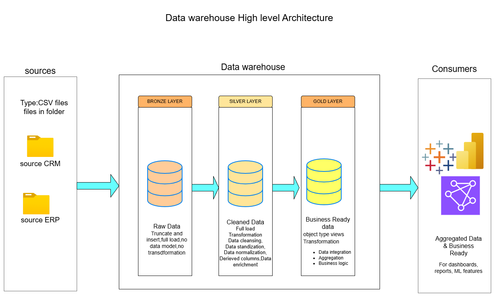

# Data_warehouse_bronze-silver-gold-pipeline

Built on the Medallion Architecture, this MySQL Data Warehouse unifies ERP & CRM sales data transforming raw inputs into a clean, structured, and analytics ready model.
---
## 📌 Overview

This project covers the end-to-end design and implementation of a **modern data warehouse** using MySQL.
It consolidates sales data from multiple source systems (ERP and CRM), transforms it through layered processing, and delivers a structured model optimized for analytical reporting and decision making.

| Layer | Name | Description |
| --- | --- | --- |
| 🟫 Bronze | Raw Ingestion | Load raw CSV data from ERP & CRM with no transformations |
| ⬜ Silver | Cleaned & Transformed | Standardize, deduplicate, and validate data |
| 🟨 Gold | Star Schema | Analytical model optimized for reporting and BI tools |

---

## 🎯 Objectives

- [ ]  Consolidate ERP & CRM data from CSV sources
- [ ]  Clean, deduplicate, and transform raw data
- [ ]  Build a **Star Schema** analytical data model
- [ ]  Generate insights on customer behaviour, product performance, and sales trends

---

## 📂 Project Structure

```
Data_warehouse_bronze-silver-gold-pipeline/
├── datasets/               # Raw CSV source files (ERP & CRM)
├── sql_scripts/
│   ├── bronze/             # Raw ingestion scripts
│   ├── silver/             # Cleaning & transformation scripts
│   ├── gold/               # Star schema model scripts
│   └── analytics/          # Reporting & insight queries
├── Docs/                   # Architecture diagrams & documentation
└── README.md
```

---

## 🔄 Pipeline

1. **Ingest** – Load raw CSV files → Bronze layer
2. **Clean** – Standardize & validate data → Silver layer
3. **Model** – Build Star Schema (Facts + Dimensions) → Gold layer
4. **Analyze** – Run analytics queries for business insights


---

## 📊 Key Insights

- 🏆 **Top customers** by total revenue
- 📦 **Best-selling products** by quantity and revenue
- 📈 **Monthly sales trends** over time

---

## 🛠️ Tech Stack

- **Database:** MySQL
- **Data Format:** CSV (ERP & CRM exports)
- **Modeling:** Star Schema (Fact & Dimension tables)
- **Architecture:** Medallion (Bronze → Silver → Gold)
